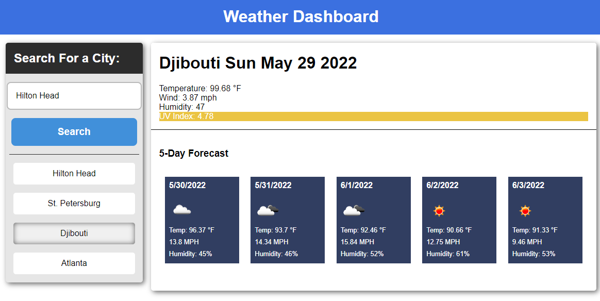

# Weather Dashboard
### Homework 06 - Topic: Server-Side API
### Author - Joseph Pugmire

This is a weather dashboard that allows a user to search for a city and view current and future conditions for that city.
Also includes a search history.

### Screenshot

## [Deployed Link](https://jpugmire.github.io/hw-05-planner/)
